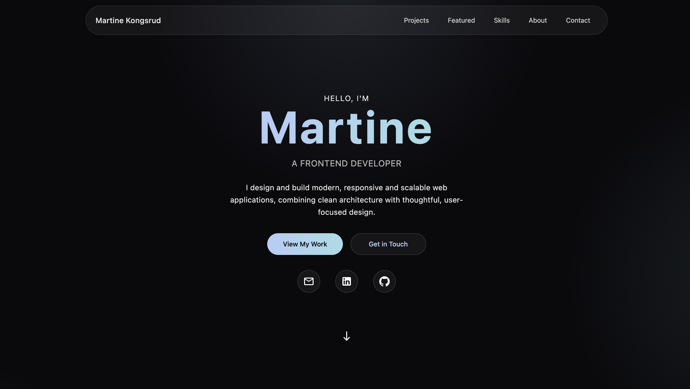

# Portfolio V2

My personal portfolio website is built with **React, TypeScript and Tailwind CSS**.  
It showcases selected projects from my two years studying to become a Frontend Developer at Noroff.

🔗 Live site: [Portfolio website](https://martinekongsrud.netlify.app/)

## Overview

The goal was to create:

- A clean, modern and professional presentation
- A scalable project structure
- Reusable UI components
- A consistent design system

## Features

- Responsive layout
- Modern glass-inspired UI
- Reusable UI components (Button, SectionHeader, Cards)
- Structured project data model
- Modular folder structure

## Tech stack and tools

- React
- TypeScript
- Tailwind CSS
- React Router
- Vite
- MUI Icons

## Contact

If you have any questions or feedback, feel free to reach out:

- [LinkedIn](https://www.linkedin.com/in/martine-kongsrud)
- Email: [martinekongsrud@outlook.com](mailto:martinekongsrud@outlook.com)
